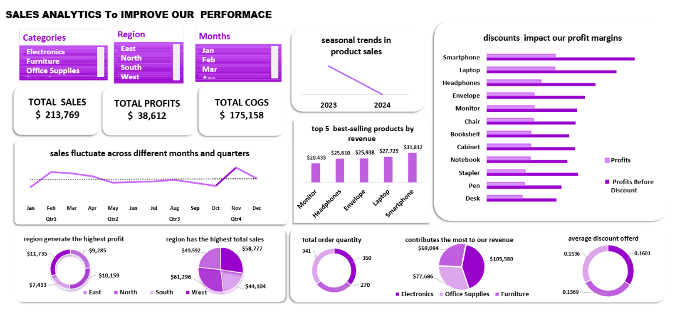

# Sales Analysis Project

## Objective
The primary goal of this project is to analyze sales data to provide actionable insights that improve business performance. This involves evaluating sales trends, identifying top-selling products, assessing the impact of discounts, and understanding regional sales variations.

## Business Needs
Businesses require a data-driven approach to optimize inventory, maximize profits, and allocate resources efficiently. This analysis helps answer critical questions such as:
- Which products generate the most revenue?
- How do discounts impact profit margins?
- What are the seasonal trends in sales?
- Which regions contribute the most to sales and profits?

## Methodology

### Data Collection & Cleaning
The dataset includes order details, product categories, revenue, and profit. Some missing values were handled to ensure data accuracy.

### Exploratory Data Analysis (EDA)
- Identified top-selling products (e.g., smartphones and laptops).
- Analyzed revenue contribution by product categories (Electronics led in sales).
- Evaluated regional sales trends (North had the highest sales, West had the highest profit).

### Visualization & Insights
- Created interactive dashboards using Excel to present trends.
- Compared sales performance between 2023 and 2024 (sales decline observed in 2024).
- Analyzed the effect of discounts, showing that some products had a 50% reduction in profit due to discounts.

## Key Findings
- **Total Sales**: $213,769  
- **Total Profits**: $38,612  
- **Total COGS**: $175,158
- Discounts heavily impact profit margins.
- Some products require higher stock levels due to high sales volumes.
- Electronics contribute the most revenue but also have the highest discount rates.

## Conclusion & Recommendations
The insights derived from this analysis help businesses make informed decisions regarding product pricing, discount strategies, and stock optimization. Future improvements could include predictive analytics to forecast sales trends and refine inventory management.

##  Dashboard

Here is a snapshot of the sales dashboard used in this analysis:

