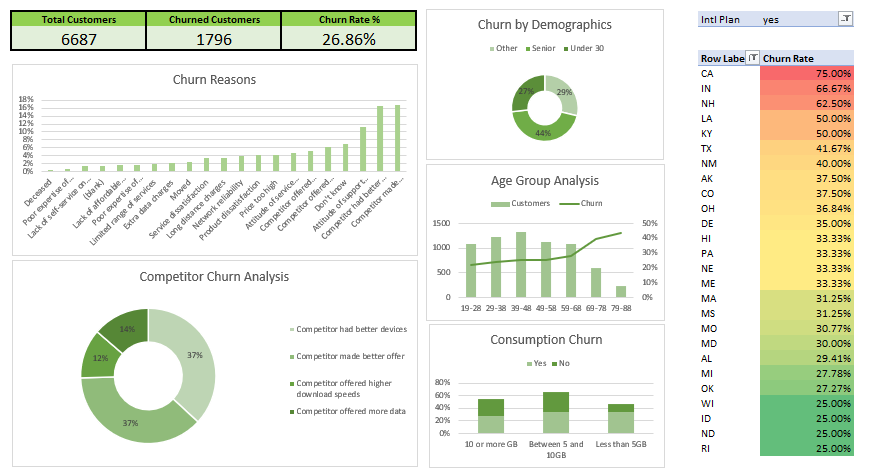

# Sales Analytics & Customer Churn 

This project is a Sales and Customer Churn Analytics Dashboard built using `Excel`. 
It is designed to explore key business metrics related to customer behavior, churn patterns, and service usage for a telecommunications or subscription-based service provider.

## File Structure

The project is organized into the following sheets:

### 1. Overview
Provides high-level KPIs, including:
- Total customers
- Churned customers
- Overall churn rate

### 2. Databel - Aggregate
Aggregated data across customers with demographics and service usage features:
- Gender, age group  
- Account length, monthly charges
- International call activity, data usage, customer service calls
- Grouped consumption and churn behavior

### 3. Churn Analysis
Summarized churn rates by specific customer segments such as:
- Senior group
- Younger users
- Other demographics

### 4. Databel - Customer
Detailed customer-level dataset including:
- Churn label (Yes/No)
- Usage metrics: local calls, international mins, extra charges
- Contract types, payment methods, device protection
- Monthly and total charges

### 5. Customer Pivots
Pivotal insights summarizing churn statistics and totals, used for dashboard visualizations.

---

## Key Analysis Goals

- Churn Detection: Understand who is churning and why.
- Customer Segmentation: Group users by usage, demographics, or contract type.
- Usage Patterns: Investigate customer service interactions, international usage, and data consumption.
- Retention Strategies: Identify at-risk groups for targeted retention.

##  Technologies Used

- Excel: For data storage, pivot tables, analysis, and visualization.
- Power Query : For advanced data manipulation .
- Charts & Pivot Tables: Visual storytelling for business decisions.

 
